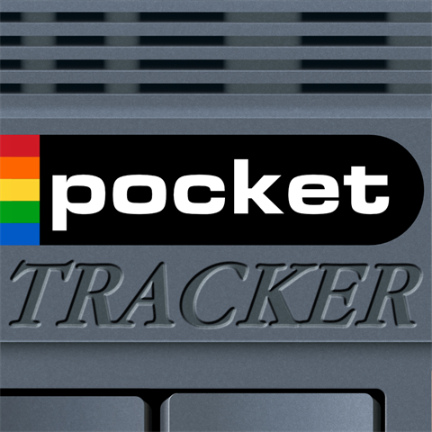
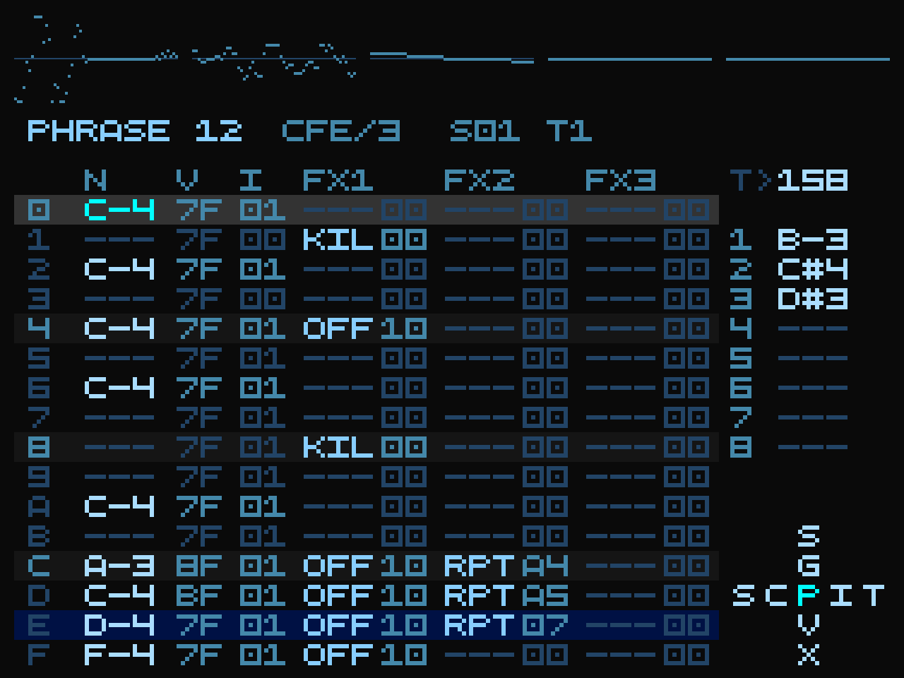

# SPRITESTEP

<p align="center">
  
  &nbsp;&nbsp;
  
</p>

SPRITESTEP is a music tracker for small screens — a retro gaming handheld, a smartphone, or your desktop. It carries on the spirit of trackers like LSDJ and LGPT. It's free, open-source, and runs on hardware you've probably already got — the goal is to put a capable music-making tool in anyone's pocket.

One codebase and one audio engine across Android, Linux handhelds, Linux desktop and Windows: the same 640×480 design, the same sound, the same project files.

> **Note:** This project was developed with AI assistance. If that bothers you, this project isn't for you.

**Status:** 0.9.8 — public beta

**License:** [GPL-3.0](LICENSE)

---

## Features

### Instruments
Two instrument types: a **sampler** that loads WAV, MP3, M4A, FLAC, OGG and Opus files, and a **SoundFont** player for SF2 and SF3 files.

### Sampling from video
Just screen record stuff from YouTube or your favourite video games and sample it with the built-in video-to-WAV converter!

### Sample editor
Manipulate the waveform, add effects, repitch, STRETCH (can't wait to hear your jungle tunes), slice (destructively or just add slice markers to your sample).

### Controls
SPRITESTEP is made for gaming handhelds with physical buttons. For phones and other touchscreen devices, there's an on-screen control layout.

### Effects
Overdrive, bitcrusher, filters, EQs, reverb and delay (as send channels), and a master bus with OTT (aggressive soundgoodizer) or DUST (a special blend from Skoomabwoy to squish your tracks and make them more lofi-ish). All of them can be applied to your samples in the sample editor!

### Mixing & export
Arrange a song across eight stereo tracks and balance it on a mixer with per-track sends and true dBFS meters. Export the finished mix as a WAV, or export each track as a separate stem.

### Resampling
Record selected sequence part into a new sample — for layering drums, freezing a chord into a pad, or flattening a section to build on.

### Appearance
There are a few options to customize the app interface. The top bar has six visualizer modes that vary from a ProTracker2 look to a Pioneer-style stereo tower. There are also interface color themes and a theme editor to make your own. As a bonus, phones come with an Amiga-inspired touchscreen button skin.

➡️ Full feature list: [`docs/features.md`](docs/features.md)

---

## Supported platforms

| Platform | Package | Notes |
|---|---|---|
| **Android** | `.apk` | Phones and Android gaming handhelds. Touch layout or physical buttons. |
| **Linux handheld** | PortMaster `.zip` | aarch64 CFW handhelds (ArkOS, muOS, JELOS, Knulli, ROCKNIX…). |
| **Linux desktop** | `.tar.gz` | x86-64. |
| **Windows** | `.zip` | x86-64, no installer. |

**Android minimum:** Android 8.0 (API 26) · 64-bit (arm64-v8a / x86_64) · ~512 MB RAM · ~50 MB storage · 640×480 screen

Tested on the **Miyoo Flip** (1 GB RAM, GammaOSCore Android 13), **Ayaneo Pocket Air Mini** (3 GB RAM, Android 11), **Fairphone 6** (8 GB RAM, /e/os v3.0.4 Android 15) and **Xiaomi 12T Pro** (8 GB RAM, LineageOS Android 16)

---

## Installation

All packages are on the [Releases](https://github.com/conanizer/spritestep/releases) page.

### Android

**F-Droid:** SPRITESTEP is in the main F-Droid repository. Tap the badge, or search for it in the F-Droid app.

[](https://f-droid.org/packages/com.conanizer.spritestep/)

**Obtainium:** install [Obtainium](https://github.com/ImranR98/Obtainium), then tap the badge below on your device. SPRITESTEP is added straight from GitHub Releases and Obtainium keeps it up to date automatically — new versions appear here on release day, a few days before F-Droid builds them.

[](https://apps.obtainium.page/redirect?r=obtainium://add/https://github.com/conanizer/spritestep)

If the badge doesn't open Obtainium, add this URL as an app source inside Obtainium instead:

```
https://github.com/conanizer/spritestep
```

**Manual:** download `SPRITESTEP-<version>.apk` and open it on your device (allow "install from unknown sources" if asked).

⚠️ **Pick one and stay with it.** F-Droid builds and signs its own copy, so its APK and the one from GitHub Releases carry different signatures. Android will not install either over the other — switching means uninstalling first, which takes your settings with it. Your projects and samples are untouched.

SPRITESTEP requests **no permissions**. On first run, open a file browser and press **A** on the `ADD FOLDER...` row — Android's folder picker opens, and the folder you choose is where your projects, samples and renders live. See the [quick-start guide](docs/quick-start-guide.md).

### Linux handheld (PortMaster)

For aarch64 CFW handhelds — ArkOS, muOS, JELOS, Knulli, ROCKNIX and friends. Nothing extra is needed — no BIOS, no runtime, no gptokeyb.

1. Download `SPRITESTEP-<version>-portmaster-aarch64.zip`.
2. Copy it, **still zipped**, into the `autoinstall` folder inside your device's PortMaster folder. (Recent PortMaster versions also watch `ports/autoinstall/`.)
3. Open **PortMaster**. It installs the port and removes the zip.
4. Launch **SPRITESTEP** from the Ports menu.

Let PortMaster unpack it rather than unzipping it yourself — unzipping on a PC and copying the files across can strip the permissions the port needs, and it then does nothing when you launch it.

Your projects, samples and settings live in `ports/spritestep/data/`, created on first launch — copy samples in there over USB or the network.

The port uses your device's own SDL2, so it follows whatever your firmware already does about the screen and audio.

### Linux desktop

```bash
tar xzf SPRITESTEP-<version>-linux-x64.tar.gz
cd SPRITESTEP-<version>
./SPRITESTEP
```

SDL2 is the only runtime dependency:

| Distribution | Command |
|---|---|
| Debian / Ubuntu | `sudo apt install libsdl2-2.0-0` |
| Fedora | `sudo dnf install SDL2` |
| Arch | `sudo pacman -S sdl2` |

Your files live in `$XDG_DATA_HOME/SPRITESTEP` (usually `~/.local/share/SPRITESTEP`), in `Projects/`, `Samples/` and `Soundfonts/`. Set `SPRITESTEP_HOME` to put them somewhere else.

### Windows

1. Download `SPRITESTEP-<version>-windows-x64.zip`.
2. Unzip it anywhere — it is a folder, not an installer.
3. Run **SPRITESTEP.exe**.

Nothing else to install: SDL2 and the Visual C++ runtime are both linked in. Windows SmartScreen will warn about an unsigned executable the first time — *More info* → *Run anyway*. A console window opens behind the tracker and stays there on purpose: it prints what the audio device and display actually did and whether your samples loaded, which is the most useful thing to attach to a bug report. Closing it closes the app.

Your files live in `Documents\SPRITESTEP\` — `Projects\`, `Samples\`, `Soundfonts\`.

### Controls on desktop

The desktop builds read a gamepad through SDL, and also map the keyboard. See [`docs/input-system.md`](docs/input-system.md) for the full reference.

---

## Documentation

| Document | Contents |
|---|---|
| [`docs/quick-start-guide.md`](docs/quick-start-guide.md) | Quick start — from install to your first beat |
| [`docs/manual-en.md`](docs/manual-en.md) | Full user manual |
| [`docs/input-system.md`](docs/input-system.md) | Complete controls reference |
| [`docs/features.md`](docs/features.md) | Feature overview |
| [`docs/technical-architecture.md`](docs/technical-architecture.md) | Architecture overview |
| [`docs/building.md`](docs/building.md) | Building from source |

---

## Building from source

The engine, the sequencer and the whole UI are portable C++17 under `native/`; each platform adds a thin shell around them. Full instructions for all four platforms: [`docs/building.md`](docs/building.md).

---

## Contributing

- Bug reports → GitHub Issues
- Feature requests / questions → GitHub Discussions
- Or reach me on [Discord](https://discord.gg/Va72sWDmVA) for any kind of feedback

---

## Credits

SPRITESTEP is built on excellent open-source work — Oboe, DaisySP, TinySoundFont, KissFFT, dr_libs, libopus, and more. Inspired by **M8**, **LGPT**, and **LSDJ**.

Full attributions, licenses, and DSP algorithm references: [`CREDITS.md`](CREDITS.md).

**Third-party license notices** for everything compiled into SPRITESTEP — the audio engine and the
SDL shell alike, across all four packages — are reproduced in full in
[`docs/licenses/THIRD-PARTY-NOTICES.md`](docs/licenses/THIRD-PARTY-NOTICES.md).

---

## License

SPRITESTEP is free software: you can redistribute it and/or modify it under the terms of the **GNU General Public License v3.0 or later** as published by the Free Software Foundation.

It is distributed in the hope that it will be useful, but **without any warranty** — without even the implied warranty of merchantability or fitness for a particular purpose. See the [GNU General Public License](https://www.gnu.org/licenses/gpl-3.0.html) for details.

Full license text: [`LICENSE`](LICENSE).

SPRITESTEP statically links several third-party components, each under its own license (BSD-3-Clause,
MIT, LGPL-2.1, zlib, and public-domain dedications). Their copyright notices and license terms are
reproduced in [`docs/licenses/THIRD-PARTY-NOTICES.md`](docs/licenses/THIRD-PARTY-NOTICES.md).

That file, the GPL text and [`CREDITS.md`](CREDITS.md) ship **inside every release artifact**, not just
in this repository — `licenses/` in the Windows zip, the Linux tarball and the PortMaster zip, and
`assets/licenses/` inside the Android APK. If you received only a binary, the notices came with it.
